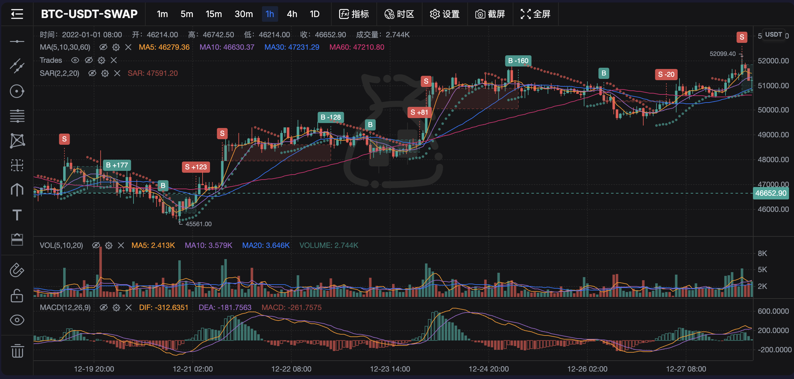

<h1 align="center">TradingChest</h1>
<p align="center">Professional trading chart library targeting TradingView-level capabilities. Built on KLineChart.</p>

<div align="center">

[](https://www.npmjs.com/package/trading-chest)
[](dist/index.d.ts)
[](LICENSE)

**English** | [中文](README.zh-CN.md) | [日本語](README.ja.md) | [한국어](README.ko.md)

</div>

<p align="center">
  
</p>

## Features

### Technical Indicators (73+)

| Category | Count | Examples |
|----------|-------|----------|
| Trend | 21 | MA, EMA, BOLL, Ichimoku, SuperTrend, Alligator, KAMA, HMA... |
| Volatility | 9 | Keltner Channels, Donchian Channels, ATR, Bollinger Band Width... |
| Volume | 12 | VOL, VWAP, MFI, CMF, Klinger Oscillator, Elder Ray... |
| Momentum | 26 | MACD, RSI, KDJ, StochRSI, ADX, Aroon, Fisher Transform, PPO... |
| Other | 2 | Pivot Points, ZigZag |

- Category tabs for quick filtering (Trend / Volatility / Volume / Momentum / Other)
- Real-time search filtering
- Customizable indicator parameters
- Lazy-loaded indicator registration for faster startup

### Drawing Tools (42+)

| Category | Tools |
|----------|-------|
| Lines | Horizontal, Vertical, Trend, Ray, Segment, Arrow, Price Line, Parallel, Price Channel |
| Fibonacci | Retracement, Segment, Circle, Spiral, Speed Resistance Fan, Trend Extension |
| Waves | 3-Wave, 5-Wave, 8-Wave, Any-Wave, ABCD, XABCD |
| Geometry | Circle, Rectangle, Triangle, Parallelogram |
| Patterns | Andrew's Pitchfork, Schiff Pitchfork, Linear Regression, Regression Channel, Gann Box |
| Measurement | Price Range, Time Range, Combined Measurement |
| Annotations | Text Label, Annotation Bubble, Sticky Note, Freehand Drawing |
| Trading | Long / Short Position (Entry / Stop-loss / Take-profit visualization + Risk/Reward ratio) |

- Hover tooltip on all tools
- Text tools support inline editing + right-click edit
- **Floating property toolbar on selected drawing** (TradingView-style):
  - 9×8 color palette (72 colors)
  - Line width selector (1–4px visual preview)
  - Line style selector (solid / dashed / dotted)
  - Lock / Delete quick buttons

### Chart Types (8)

Candle Solid, Candle Hollow, Up Hollow, Down Hollow, OHLC, Area, **Heikin Ashi**, **Baseline**

### Price Alerts

- Add / remove alert lines at specific prices
- Callback when price crosses alert level
- Visual overlay on chart
- Works in both live and replay modes

### Symbol Comparison

- Overlay additional symbols normalized to percentage change
- Automatic cross-symbol timestamp alignment

### Bar Replay

- Replay historical data bar-by-bar
- Play / Pause / Step Forward / Step Backward / Go To Position
- Adjustable speed (0.5×–16×)
- Alert system active during replay

### Trade Visualization

- Overlay buy/sell markers on the chart from trade records
- Click detection on trade markers with callback
- Integrates with `IndicatorClickDetector`

### Settings Panel

- Candle type selection
- Up / Down color customization (color picker)
- Price axis type (Linear / Percentage / Logarithmic)
- Crosshair visibility (Horizontal / Vertical independent control)
- Grid lines, High / Low markers, Tooltip type
- Grouped settings (Candle / Axis / Grid & Crosshair)

### Other

- **Keyboard Shortcuts**: 15+ default bindings (Alt+T trend line, Alt+F Fibonacci, etc.), fully customizable
- **5 Theme Presets**: Dark, Light, Midnight Blue, Classic (TradingView-style), High Contrast
- **Data Export**: CSV (visible range / all data), Screenshot (PNG / JPEG)
- **Layout Persistence**: Save / Load / Delete chart layouts via localStorage
- **i18n**: Chinese (zh-CN), English (en-US)
- **Timezone**: 14 timezone support

## Install

```bash
npm install trading-chest klinecharts
```

## Usage

```typescript
import { KLineChartPro } from 'trading-chest'
import 'trading-chest/dist/trading-chest.css'

const chart = new KLineChartPro({
  container: document.getElementById('chart'),
  symbol: {
    ticker: 'BTC-USDT',
    name: 'Bitcoin',
    exchange: 'Binance',
    pricePrecision: 2,
    volumePrecision: 4,
  },
  period: { multiplier: 1, timespan: 'day', text: '1D' },
  datafeed: {
    searchSymbols: async () => [],
    getHistoryKLineData: async (symbol, period, from, to) => {
      // Return KLineData[] — implement your data fetching logic
      return []
    },
    subscribe: () => {},
    unsubscribe: () => {},
  },
  theme: 'dark',
  locale: 'en-US',
})

// Don't forget to dispose when done
// chart.dispose()
```

## API

### Constructor Options

```typescript
interface ChartProOptions {
  container: string | HTMLElement
  symbol: SymbolInfo
  period: Period
  datafeed: Datafeed
  styles?: DeepPartial<Styles>
  watermark?: string | Node
  theme?: string              // default: 'light'
  locale?: string             // default: 'zh-CN'
  drawingBarVisible?: boolean // default: true
  periods?: Period[]
  timezone?: string           // default: 'Asia/Shanghai'
  mainIndicators?: string[]   // default: ['MA']
  subIndicators?: string[]    // default: ['VOL']
  onIndicatorClick?: (event: IndicatorClickEvent) => void
  onAlertTrigger?: (event: AlertEvent) => void
}
```

### Instance Methods

```typescript
// Theme
chart.setTheme('dark' | 'light')
chart.getTheme(): string

// Styles
chart.setStyles(styles: DeepPartial<Styles>)
chart.getStyles(): Styles

// Locale
chart.setLocale('zh-CN' | 'en-US')
chart.getLocale(): string

// Timezone
chart.setTimezone('Asia/Shanghai')
chart.getTimezone(): string

// Symbol / Period
chart.setSymbol(symbol: SymbolInfo)
chart.getSymbol(): SymbolInfo
chart.setPeriod(period: Period)
chart.getPeriod(): Period

// Internal chart instance (for custom overlay operations)
chart.getChart(): Chart | null

// Data Export
chart.exportCSV(filename?: string)
chart.exportAllCSV(filename?: string)
chart.exportScreenshot({ format?, backgroundColor?, filename? })

// Keyboard Shortcuts
chart.getShortcutManager(): KeyboardShortcutManager

// Alerts
chart.addAlert({ id, price, condition, color? })
chart.removeAlert(id: string)
chart.getAlerts(): AlertConfig[]
chart.feedPrice(price: number)     // Feed live price for alert checking

// Symbol Comparison
chart.addComparison(symbol: SymbolInfo): Promise<void>
chart.removeComparison(ticker: string)

// Bar Replay
chart.startReplay(startPosition?: number)
chart.stopReplay()
chart.getReplayEngine(): ReplayEngine | null

// Trade Visualization
chart.createTradeVisualization(trades: TradeRecord[], paneOptions?)
chart.getClickDetector(): IndicatorClickDetector

// Lifecycle
chart.dispose()
```

### Exports

```typescript
import {
  KLineChartPro,
  DefaultDatafeed,
  loadLocales,

  // Themes
  themePresets,
  getThemeByName,

  // Data Export
  exportToCSV, exportAllToCSV, exportScreenshot,

  // Layout Persistence
  saveLayout, loadLayout, deleteLayout, listLayouts,

  // Keyboard Shortcuts
  KeyboardShortcutManager,

  // Indicators
  indicatorCategories,
  indicatorRegistry,

  // Alerts
  AlertManager,

  // Comparison
  normalizeToPercent,

  // Replay
  ReplayEngine,
} from 'trading-chest'
```

## Tech Stack

- **Rendering Engine**: [KLineChart](https://github.com/klinecharts/KLineChart) 9.x (Canvas, high performance)
- **UI Framework**: [Solid.js](https://www.solidjs.com/) (reactive, lightweight)
- **Build Tool**: [Vite](https://vitejs.dev/) (ESM + UMD dual output)
- **Language**: TypeScript (zero `@ts-expect-error` for project code)
- **Testing**: Vitest (211 tests, 18 test files)

## Build

```bash
npm install
npm run build       # Full build (JS + CSS + .d.ts)
npm run test        # Run tests
```

Build artifacts:
- `dist/trading-chest.js` — ES Module (~291KB, gzip ~81KB)
- `dist/trading-chest.umd.js` — UMD
- `dist/trading-chest.css` — Styles (~42KB)
- `dist/index.d.ts` — TypeScript declarations

## Based On

Forked from [KLineChart Pro](https://github.com/klinecharts/pro), significantly extended:

- 45+ custom technical indicators with lazy-loading registry
- 13+ drawing tools (measurement, annotations, trade position visualization)
- Floating property toolbar on selected drawings (color palette, line width/style, lock/delete)
- Keyboard shortcut system, theme presets, data export, layout persistence
- Price alert system with live/replay integration
- Symbol comparison overlay (normalized percentage)
- Bar replay engine with step/play/speed controls
- Trade visualization with click detection
- Indicator panel with category tabs + search
- Settings panel with grouped options + color picker
- Full resource cleanup via `dispose()` — zero memory leaks

## License

Apache License 2.0
